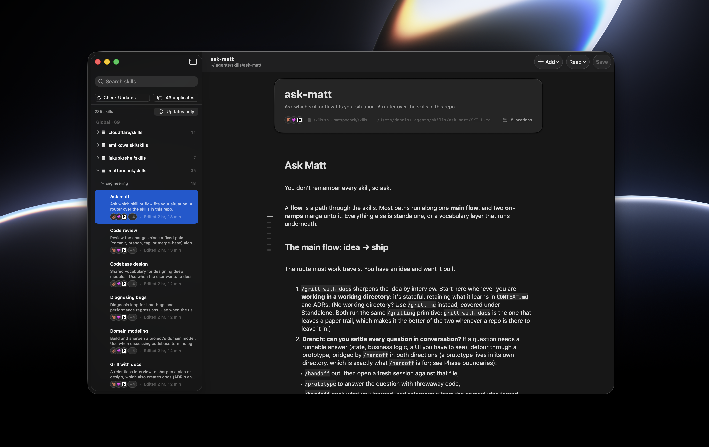

# SkillKit

SkillKit is a native macOS app for managing Agent Skills, the `SKILL.md` packages used by Claude Code, Cursor, OpenCode, Codex, and the rest of the `npx skills` ecosystem. It finds skills across global agent folders and projects beneath your work folders, then gives you one place to read, edit, install, update, and link them.

[](https://github.com/DennisKraaijeveld/SkillKit/releases/latest)



## What it does

- Finds skills in the usual global folders (`~/.agents/skills`, `~/.claude/skills`, `~/.codex/skills`, `~/.cursor/skills`, OpenCode, Gemini, and others), plus any folders you add.
- Scans every registered work folder for agent-specific skill folders such as `.agents/skills`, `.claude/skills`, and `.cursor/skills`.
- Treats symlinked placements as one canonical skill while keeping every location visible. The sidebar groups skills by scope, project, collection, category, and skill.
- Reads `~/.agents/.skill-lock.json` and project `skills-lock.json` files to find upstream GitHub sources, then falls back to `git remote` for skills stored in clones.
- Searches the live `skills.sh` catalog, marks skills already in your library, and installs a selected skill globally or in a project found with the shared fuzzy project picker.
- Links a canonical skill into one or more project agent folders with **Use in Project**, or installs an independent project copy from its `skills.sh` source. SkillKit never overwrites an existing file.
- Updates a single skill with the same command used by the CLI: `npx skills add <owner/repo/path> --skill <name> -g -y`.
- Finds independent duplicates by upstream identity or identical local `SKILL.md` content. Symlinked placements do not count as duplicates.
- Opens `SKILL.md` in **Edit**, **Read**, or **Raw** mode with TextKit 2 editing, read-only rendering, a compact section rail, and syntax-aware source editing. YAML frontmatter stays separate, so saving a skill does not flatten unknown keys.
- Installs skill packs, creates new skills, and moves unwanted skill folders to the Trash.

## Build from source

You need macOS 15 or later, Xcode 16 or later, a Rust toolchain from `rustup`, and XcodeGen.

```bash
brew install xcodegen
cd macos
xcodegen
open SkillKit.xcodeproj
```

Xcode’s pre-build phase compiles `skillbook-ffi` for the requested architectures and regenerates the Swift bindings. Debug normally builds the active architecture. Release produces a universal arm64/x86_64 archive. The first build needs `cargo` on `PATH`; the script adds `~/.cargo/bin` itself.

The live editor uses SwiftMarkdownEngine 0.12.0 under Apache-2.0. Its full license is bundled with the app.

Keep App Sandbox disabled. SkillKit needs to read agent folders in your home directory and run `npx` and `git`.

Run the Rust domain tests on Linux or macOS:

```bash
cargo test -p skillbook-core -p skillbook-ffi -p skillbook-mcp
```

The `SkillKit` Xcode scheme also runs the Swift Testing model/backend suite.

Signed app releases and the Sparkle update feed are documented in [`docs/app-updates.md`](docs/app-updates.md).

There is no Linux GUI. Architecture notes: [`docs/swiftui-migration.md`](docs/swiftui-migration.md).

## Local MCP server

SkillKit can expose your library to Codex, Claude Code, Cursor, and other MCP clients through a local STDIO server. Open **SkillKit > Settings > MCP**, install the bundled helper, and connect the clients you use. The app does not need to stay open.

SkillKit installs the signed helper at a stable path in Application Support. Connecting a client changes only its `skillkit` entry in that client’s user configuration. Start a new agent session after connecting so the client can discover the server.

The server exposes four tools:

- `search_skills` searches the live catalog with scope, project, agent, source, modified-state, and pagination filters
- `get_skill` returns one exact skill and includes its Markdown body only when requested
- `inspect_project_skills` reports project placements, missing agent links, independent duplicates, registration state, and scan errors
- `link_skill_to_project` creates conflict-safe symlinks for explicitly selected agents and registers the project when needed

The first three tools are read-only. Linking is the only write, and it is idempotent. The server does not expose installation, updates, arbitrary edits, deletion, or general configuration. A newly linked skill may require another agent session before the client sees it.

Other MCP-compatible clients can use the installed executable path shown in Settings. To run the server from this workspace, expose either the full catalog or a project-restricted view:

```bash
cargo run -p skillbook-mcp

# Expose global skills plus one project's skills and hide other project-only skills.
cargo run -p skillbook-mcp -- --project-root /absolute/path/to/project
```

Use one command or the other. The project path must already exist.

## Settings

SkillKit stores its configuration at `~/Library/Application Support/SkillKit/config.toml`.

On first launch, SkillKit checks common agent and skill locations without changing them. Choose the work folders and additional skill folders you want to scan, or continue with the detected agent folders only. SkillKit saves those choices and runs the initial scan.

After setup, add or remove work folders in **Settings** or edit the config file. Project actions search only the immediate child folders of those work folders, with Finder available as an explicit fallback. SkillKit checks public GitHub sources without authentication. Appearance follows the system unless you choose light or dark mode.

## Architecture

The macOS UI is written in SwiftUI. `skillbook-core` owns discovery, lockfiles, GitHub checks, `npx skills`, and filesystem watching; Swift talks to it through a UniFFI `Session`. Keeping that logic in Rust gives the app one source of truth for paths and skill identity, and lets the same domain code run in Linux CI. Swift passes skill IDs instead of rebuilding filesystem paths.

## Crates

- `skillbook-core`: discovery, lockfiles, git/GitHub sources, updates, and filesystem watching
- `skillbook-ffi`: the UniFFI `Session` used by the SwiftUI app
- `skillbook-mcp`: the optional local MCP server for catalog reads and conflict-safe project linking
